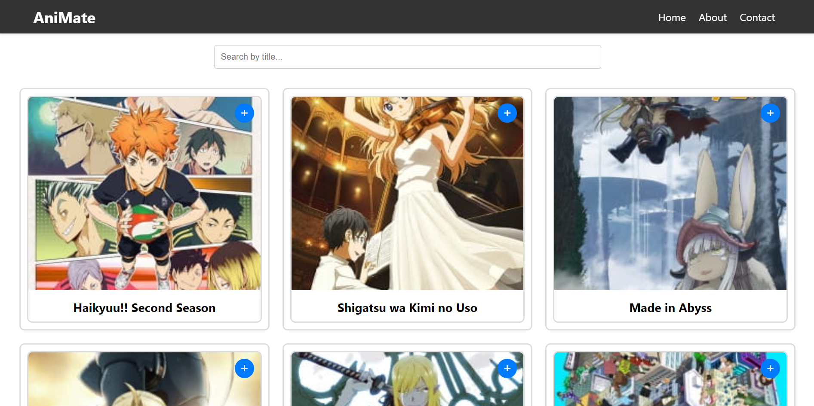
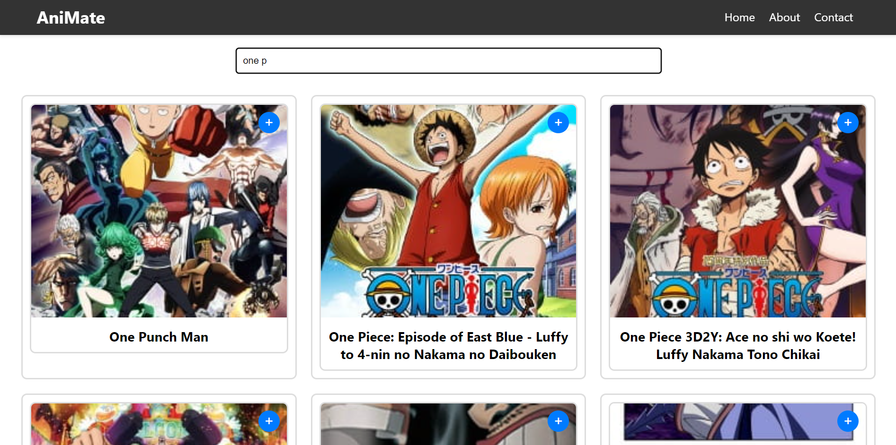
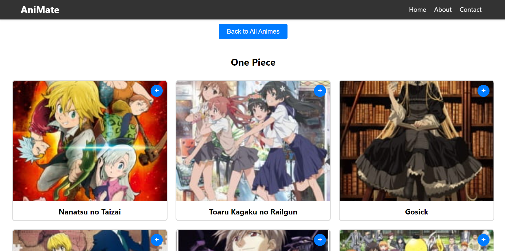
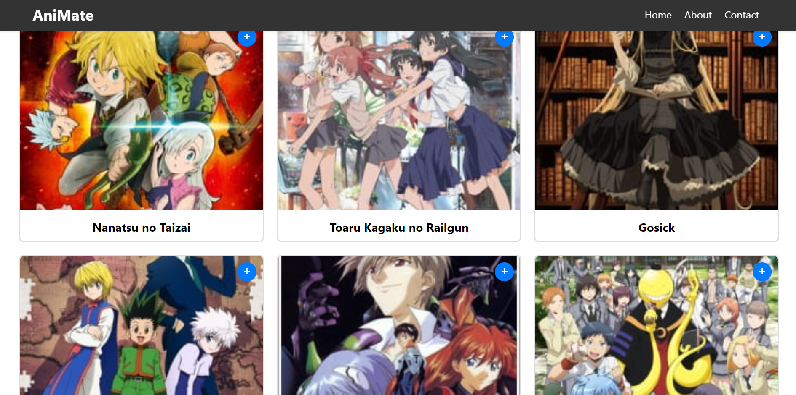
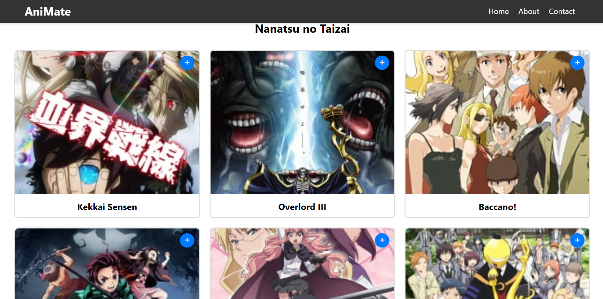
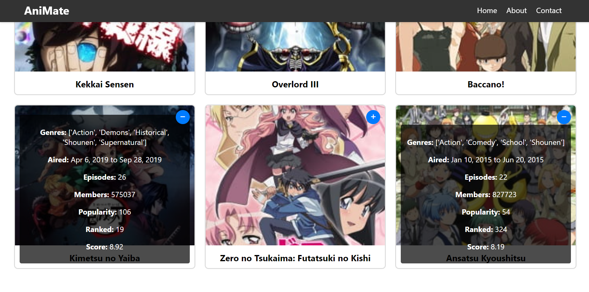

# Animate
"Animate" is an anime recommendation system using KMeans clustering, ReactJS, and FastAPI for personalized suggestions

## Model
I trained my dataset using KMeans, with 3 clusters. Then, I created a new dataset where each anime has its corresponding cluster in a new column.

## Interface
When the user opens the website, I display all the animes from the dataset in MongoDB, showing the name and picture of each anime.

The user has a search bar where they can search for the anime they like. It's asynchronous, so as they type, the display updates without needing to click a button.

Then the user chooses the anime they like the most. The website takes the cluster of the selected anime, retrieves all the animes from the same cluster, shuffles them, and displays the first 6. There's a rule: at least one genre must be in common with the chosen anime.

The user can also choose again from the six displayed animes. Then, the website will recommend another six animes based on the selected one.

The user can also click the '+' button to show more information about the anime, and '-' to close it.

